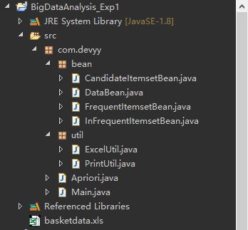
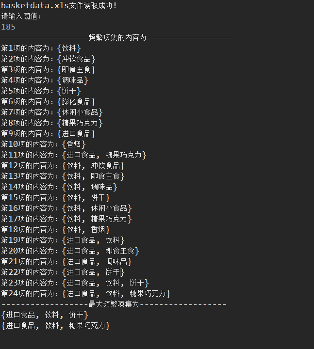

# 实时大数据分析实验一——A-Priori算法
## 一、实验内容
给定某超市购物篮数据库文件basketdata.xls，里面有18项商品的747条购买记录。取支持度阈值s =185，用A-Priori算法在Map-Reduce框架下提取其中的最大频繁项集Lk。

附件：某超市数据集basketdata.xls

## 二、实验设计（原理分析及流程）

该算法的基本思想是：首先找出所有的频集，这些项集出现的频繁性至少和预定义的最小支持度一样。然后由频集产生强关联规则，这些规则必须满足最小支持度和最小可信度。然后使用第1步找到的频集产生期望的规则，产生只包含集合的项的所有规则，其中每一条规则的右部只有一项，这里采用的是中规则的定义。一旦这些规则被生成，那么只有那些大于用户给定的最小可信度的规则才被留下来。为了生成所有频集，使用了递归的方法。

## 三、实验代码及数据记录
### 1.代码 

#### 1.0 文件结构图

#### 1.1 CandidateItemsetBean.java

	package com.devyy.bean;
	
	import java.util.List;
	
	/** 
	 * 候选项集实体类 
	 * 
	 * @author ZYY
	 * 
	 */  
	public class CandidateItemsetBean {
		private List<List<Integer>> candidateItemList;
	
		public List<List<Integer>> getCandidateItemList() {
			return candidateItemList;
		}
	
		public void setCandidateItemList(List<List<Integer>> candidateItemList) {
			this.candidateItemList = candidateItemList;
		}
	} 

#### 1.2 DataBean.java

	package com.devyy.bean;
	
	/** 
	 * DataVO实体类，封装了频繁项集，候选项集，非频繁项集。
	 *  
	 * @author ZYY
	 * 
	 */  
	public class DataBean {
		private FrequentItemsetBean frequentItemSet;
		private CandidateItemsetBean candidateItemSet;
		private InFrequentItemsetBean inFrequentItemSet;
	
		public FrequentItemsetBean getFrequentItemSet() {
			return frequentItemSet;
		}
	
		public void setFrequentItemSet(FrequentItemsetBean frequentItemSet) {
			this.frequentItemSet = frequentItemSet;
		}
	
		public CandidateItemsetBean getCandidateItemSet() {
			return candidateItemSet;
		}
	
		public void setCandidateItemSet(CandidateItemsetBean candidateItemSet) {
			this.candidateItemSet = candidateItemSet;
		}
	
		public InFrequentItemsetBean getInFrequentItemSet() {
			return inFrequentItemSet;
		}
	
		public void setInFrequentItemSet(InFrequentItemsetBean inFrequentItemSet) {
			this.inFrequentItemSet = inFrequentItemSet;
		}
	}

#### 1.3 FrequentItemsetBean.java

	package com.devyy.bean;
	
	import java.util.List;
	
	/** 
	 * 频繁项集实体类 
	 * 
	 * @author ZYY
	 * 
	 */  
	public class FrequentItemsetBean {
		private List<List<Integer>> frequentItemList;
	
		public List<List<Integer>> getFrequentItemList() {
			return frequentItemList;
		}
	
		public void setFrequentItemList(List<List<Integer>> frequentItemList) {
			this.frequentItemList = frequentItemList;
		}
	}

#### 1.4 InFrequentItemsetBean.java

	package com.devyy.bean;
	
	import java.util.List;
	
	/** 
	 * 非频繁项集实体类 
	 * 
	 * @author ZYY
	 * 
	 */  
	public class InFrequentItemsetBean {
		private List<List<Integer>> inFrequentItemList;
	
		public List<List<Integer>> getInFrequentItemList() {
			return inFrequentItemList;
		}
	
		public void setInFrequentItemList(List<List<Integer>> inFrequentItemList) {
			this.inFrequentItemList = inFrequentItemList;
		}
	}

#### 1.5 ExcelUtil.java

	package com.devyy.util;
	
	import java.io.File;
	import java.io.IOException;
	import java.util.ArrayList;
	import java.util.List;
	
	import jxl.Cell;
	import jxl.Sheet;
	import jxl.Workbook;
	import jxl.read.biff.BiffException;
	
	/** 
	 * ExcelUtil
	 * 
	 * 需导入 jxl.jar 包，其常用方法总结如下： 
	 * (1)Workbook为Excel文件，Cell为单元格，Sheet为工作表对象 
	 * (2)sheet.getCell(x,y)：获得第x行第y列的单元格 
	 * (3)workbook.getWorkbook(File):获得文件 
	 * (4)workbook.getSheet(0):获得0号(第一个)工作表对象 
	 * (5)cell.getContents():获得单元格的内容 
	 * (6)Cell[] cells = sheet.getColumn(column):获得某一列的值 
	 * (7)Cell[] cells = sheet.getRow(row):获得某一行的值 
	 * 
	 * @author ZYY
	 * 
	 */  
	public class ExcelUtil {
		/**
		 * 读取Excel文件
		 * 
		 * @param filePath——Excel文件路径
		 * @return Workbook
		 */
		public Workbook readExcel(String filePath) {
			File file = new File(filePath);
			Workbook workbook = null;
			try {
				workbook = Workbook.getWorkbook(file);
				System.out.println(filePath + "文件读取成功！");
			} catch (BiffException e) {
				System.out.println("输入流读入为空，java读取Excel异常");
				e.printStackTrace();
			} catch (IOException e) {
				System.out.println("IO异常");
				e.printStackTrace();
			}
			return workbook;
		}
	
		/**
		 * 对Excel文件工作表的内容进行封装
		 * 
		 * @param workbook——Excel文件
		 * @param sheetLoca——工作表位置
		 * @param initRowLoca——初始行，即非表头行的记录开始的行数
		 * @return 返回一个封装了一行行数据的List
		 */
		public List<Cell[]> sheetEncapsulation(Workbook workbook, int sheetLoca, int initRowLoca) {
			Sheet sheet = workbook.getSheet(sheetLoca);
			List<Cell[]> list = new ArrayList<Cell[]>();
			Cell[] cells = null;
			int i = initRowLoca - 1, length = sheet.getRows() - initRowLoca + 1;
			while (length-- != 0) {
				cells = sheet.getRow(i);
				list.add(cells);
				i++;
			}
			return list;
		}
	
		/**
		 * 当表头存在多行时，获得某一特定所需表头行，将该表头行信息保存为一个Cell数组
		 * 
		 * @param workbook——Excel文件
		 * @param sheetLoca——工作表位置
		 * @param wantLoca——想获得的特定表头行位置
		 * @return 该表头行信息Cell[]数组
		 */
		public Cell[] getHeadInfo(Workbook workbook, int sheetLoca, int wantLoca) {
			if (wantLoca == -1) {
				return null;
			} else {
				Sheet sheet = workbook.getSheet(sheetLoca);
				Cell[] cells = sheet.getRow(wantLoca - 1);
				return cells;
			}
		}
	}

#### 1.6 PrintUtil.java

	package com.devyy.util;
	
	import java.util.Iterator;
	import java.util.List;
	
	import com.devyy.bean.CandidateItemsetBean;
	import com.devyy.bean.FrequentItemsetBean;
	
	import jxl.Cell;
	
	
	/** 
	 * PrintUtil
	 * 
	 * 处理程序打印语句的工具类 
	 * 
	 * @author ZYY
	 * 
	 */  
	public class PrintUtil {
		/**
		 * 打印当前候选集内容
		 * 
		 * @param set——候选项集
		 * @param cell——表头信息数组
		 */
		public void printCandidateItemSetContent(CandidateItemsetBean set, Cell[] cell) {
			System.out.println("------------------当前候选集中的内容为------------------");
			int i = 1, j = 0;
			List<List<Integer>> list = set.getCandidateItemList();
			for (Iterator<List<Integer>> iter = list.iterator(); iter.hasNext();) {
				List<Integer> integerList = iter.next();
				System.out.print("第" + i + "项的内容为：{");
				for (j = 0; j < integerList.size() - 1; j++) {
					System.out.print(cell[integerList.get(j)].getContents() + ", ");
				}
				System.out.print(cell[integerList.get(integerList.size() - 1)].getContents());
				System.out.println("}");
				i++;
			}
		}
	
		/**
		 * 打印频繁项集的内容
		 * 
		 * @param set——频繁项集
		 * @param cell——表头信息数组
		 */
		public void printFrequentItemSetContent(FrequentItemsetBean set, Cell[] cell) {
			System.out.println("------------------频繁项集的内容为------------------");
			int i = 1, j = 0;
			List<List<Integer>> list = set.getFrequentItemList();
			for (Iterator<List<Integer>> iter = list.iterator(); iter.hasNext();) {
				List<Integer> integerList = iter.next();
				System.out.print("第" + i + "项的内容为：{");
				for (j = 0; j < integerList.size() - 1; j++) {
					System.out.print(cell[integerList.get(j)].getContents() + ", ");
				}
				System.out.print(cell[integerList.get(integerList.size() - 1)].getContents());
				System.out.println("}");
				i++;
			}
		}
	
		/**
		 * 打印最大频繁项集的内容
		 * 
		 * @param list——封装最大频繁项集的list
		 * @param cell——表头信息数组
		 */
		public void printBiggestFrequentItemSetContent(List<List<Integer>> list, Cell[] cell) {
			int j;
			System.out.println("------------------最大频繁项集为------------------");
			for (Iterator<List<Integer>> iter = list.iterator(); iter.hasNext();) {
				List<Integer> integerList = iter.next();
				System.out.print("{");
				for (j = 0; j < integerList.size() - 1; j++) {
					System.out.print(cell[integerList.get(j)].getContents() + ", ");
				}
				System.out.print(cell[integerList.get(integerList.size() - 1)].getContents());
				System.out.println("}");
			}
		}
	}

#### 1.7 Apriori.java

	package com.devyy;
	
	import java.util.ArrayList;
	import java.util.HashSet;
	import java.util.Iterator;
	import java.util.List;
	import java.util.Scanner;
	import java.util.Set;
	
	import com.devyy.bean.CandidateItemsetBean;
	import com.devyy.bean.DataBean;
	import com.devyy.bean.FrequentItemsetBean;
	import com.devyy.bean.InFrequentItemsetBean;
	import com.devyy.util.ExcelUtil;
	import com.devyy.util.PrintUtil;
	
	import jxl.Cell;
	import jxl.Sheet;
	import jxl.Workbook;
	
	/** 
	 * 首先通过单遍扫描数据集，确定每个项的支持度，得到频繁1-项集。 
	 * 接着
	 * (1)连接 
	 * (2)剪枝 
	 * 采用迭代的方法利用频繁k-1-项集生成k候选项集，扫描Excel表后从候选k-项集中找出频繁k-项集。直到生成的候选项集为空时算法结束。 
	 * 其中，用到 Apriori 性质： 
	 * 一个频繁项集的任一子集也应是频繁项集。 
	 * 逆否命题：如果一个项集是非频繁的，则它的超集也是非频繁的。 
	 * 
	 * @author ZYY
	 * 
	 */  
	public class Apriori {
		// 定义创建存放最大项集时数组的长度为100
		public static final int biggestLength = 100;
		
		private ExcelUtil excelUtil = new ExcelUtil();
		private PrintUtil printUtil = new PrintUtil();
	
		/**
		 * 计算Excel表中的列长度
		 * @param list——存放Excel表中单元格内容的Cell数组
		 * @return 列长度
		 */
		public int getColumnLength(List<Cell[]> list) {
			int maxLength = 0;
			Cell[] cells = null;
			for (int i = 0; i < list.size(); i++) {
				cells = list.get(i);
				if (cells.length > maxLength) {
					maxLength = cells.length;
				}
			}
			return maxLength;
		}
	
		/**
		 * 首先确定每个项的支持度，得到频繁1-项集及候选1-项集
		 * @param list——存放了Excel每行记录的一个list
		 * @param columnInitLoca——要进行频繁项集筛选的首列位置
		 * @param threshold——阈值
		 * @return 返回DataBean实体
		 */
		public DataBean getFrequentOneItemset(List<Cell[]> list, int columnInitLoca, int threshold) {
			int i, j, maxLength = getColumnLength(list);
			DataBean dataBean = new DataBean();
			FrequentItemsetBean frequentItemSet = new FrequentItemsetBean();
			CandidateItemsetBean candidateItemSet = new CandidateItemsetBean();
			InFrequentItemsetBean inFrequentItemSet = new InFrequentItemsetBean();
			Cell[] cells = null;
			Integer[] countArray = new Integer[maxLength];
			List<List<Integer>> frequentItemList = new ArrayList<List<Integer>>();
			List<List<Integer>> inFrequentItemList = new ArrayList<List<Integer>>();
			for (i = 0; i < countArray.length; i++) {
				countArray[i] = 0;
			}
			for (i = 0; i < list.size(); i++) {
				cells = list.get(i);
				for (j = columnInitLoca - 1; j < cells.length; j++) {
					if (cells[j].getContents().equals("T")) {
						countArray[j]++;
					}
				}
			}
			for (i = 0; i < countArray.length; i++) {
				if (countArray[i] >= threshold) {
					List<Integer> integerList = new ArrayList<Integer>();
					integerList.add(i);
					frequentItemList.add(integerList);
				} else {
					List<Integer> integerList2 = new ArrayList<Integer>();
					integerList2.add(i);
					inFrequentItemList.add(integerList2);
				}
			}
			frequentItemSet.setFrequentItemList(frequentItemList);
			candidateItemSet.setCandidateItemList(frequentItemList);
			inFrequentItemSet.setInFrequentItemList(inFrequentItemList);
			dataBean.setFrequentItemSet(frequentItemSet);
			dataBean.setCandidateItemSet(candidateItemSet);
			dataBean.setInFrequentItemSet(inFrequentItemSet);
			return dataBean;
		}
	
		/**
		 * 对候选子集进行剪枝
		 * @param dataBean——DataBean实体
		 * @return 返回修改后的DataBean实体
		 */
		public DataBean pruning(DataBean dataBean) {
			InFrequentItemsetBean inFrequentItemSet = dataBean.getInFrequentItemSet();
			CandidateItemsetBean candidateItemSet = dataBean.getCandidateItemSet();
			List<List<Integer>> inFrequentItemList = inFrequentItemSet.getInFrequentItemList();
			List<List<Integer>> candidateItemList = candidateItemSet.getCandidateItemList();
			List<List<Integer>> candidateItemWillBeMovedList = new ArrayList<List<Integer>>();
			for (Iterator<List<Integer>> iter = candidateItemList.iterator(); iter.hasNext();) {
				List<Integer> candidateItem = iter.next();
				for (Iterator<List<Integer>> iter2 = inFrequentItemList.iterator(); iter2.hasNext();) {
					List<Integer> inFrequentItem = iter2.next();
					if (candidateItem.containsAll(inFrequentItem)) {
						candidateItemWillBeMovedList.add(candidateItem);
					}
				}
			}
			inFrequentItemList.addAll(candidateItemWillBeMovedList);
			candidateItemList.removeAll(candidateItemWillBeMovedList);
			candidateItemSet.setCandidateItemList(candidateItemList);
			inFrequentItemSet.setInFrequentItemList(inFrequentItemList);
			dataBean.setCandidateItemSet(candidateItemSet);
			dataBean.setInFrequentItemSet(inFrequentItemSet);
			return dataBean;
		}
	
		/**
		 * 组成新的候选子集
		 * @param dataBean——DataBean实体
		 * @return 修改后的DataBean实体
		 */
		public DataBean createCandidateItemSet(DataBean dataBean) {
			CandidateItemsetBean candidateItemSet = dataBean.getCandidateItemSet();
			List<List<Integer>> candidateItemList = candidateItemSet.getCandidateItemList();
			List<List<Integer>> newCandidateItemList = new ArrayList<List<Integer>>();
			Set<List<Integer>> newCandidateItemListSet = new HashSet<List<Integer>>();
			for (int i = 0; i < candidateItemList.size(); i++) {
				List<Integer> candidateItem1 = candidateItemList.get(i);
				for (int j = i + 1; j < candidateItemList.size(); j++) {
					Set<Integer> set = new HashSet<Integer>();
					List<Integer> candidateItem2 = candidateItemList.get(j);
					for (int m = 0; m < candidateItem1.size(); m++) {
						set.add(candidateItem1.get(m));
						set.add(candidateItem2.get(m));
					}
					if (set.size() == (candidateItem1.size() + 1)) {
						List<Integer> newCandidateList = new ArrayList<Integer>();
						newCandidateList.addAll(set);
						newCandidateItemList.add(newCandidateList);
					}
				}
			}
			newCandidateItemListSet.addAll(newCandidateItemList);
			List<List<Integer>> resultList = new ArrayList<List<Integer>>();
			resultList.addAll(newCandidateItemListSet);
			candidateItemSet.setCandidateItemList(resultList);
			dataBean.setCandidateItemSet(candidateItemSet);
			return dataBean;
		}
	
		/**
		 * 得到频繁-k项集
		 * @param dataBean——DataBean实体
		 * @param sheet——工作表
		 * @param cellList——单元格List
		 * @param threshold——阈值
		 * @param columnInitLoca——要进行频繁项集筛选的首列位置
		 * @return 修改后的DataBean实体
		 */
		public DataBean getFrequentKItemSet(DataBean dataBean, Sheet sheet, List<Cell[]> cellList, int threshold,
				int columnInitLoca) {
			int i, j, n;
			boolean flag = true;
			FrequentItemsetBean frequentItemSet = dataBean.getFrequentItemSet();
			List<List<Integer>> frequentItemList = frequentItemSet.getFrequentItemList();
			CandidateItemsetBean candidateItemSet = dataBean.getCandidateItemSet();
			List<List<Integer>> candidateItemList = candidateItemSet.getCandidateItemList();
			if (!candidateItemList.isEmpty()) {
				List<Integer> candidateItem = candidateItemList.get(0);
				int candidateItemlength = candidateItem.size();
				Integer[] candidateArray = new Integer[candidateItemlength];
				InFrequentItemsetBean inFrequentItemSet = new InFrequentItemsetBean();
				List<List<Integer>> inFrequentItemList = new ArrayList<List<Integer>>();
				// 用于存放每次取到的cell的内容的值
				String[] cellArray = new String[candidateItemlength];
				List<Cell[]> cellColumnList = new ArrayList<Cell[]>();
				// 将候选集的Excel的那几列存为一个个数组，并将数组封装在一个List里
				for (i = 0; i < candidateItemlength; i++) {
					Cell[] cell = new Cell[sheet.getRows()];
					cellColumnList.add(cell);
				}
				// 计数器
				int[] countArray = new int[candidateItemList.size()];
				// 计数器的初始化
				for (i = 0; i < countArray.length; i++) {
					countArray[i] = 0;
				}
				// 遍历候选集
				for (i = 0; i < candidateItemList.size(); i++) {
					flag = true;
					// 候选集中的候选项下标
					candidateItem = candidateItemList.get(i);
					// 取出该候选项中所要比较的列，并保存到cellColumnList中
					for (j = 0; j < candidateItemlength; j++) {
						cellColumnList.set(j, sheet.getColumn(candidateItem.get(j)));
					}
					// 将该候选项里面存放的Integer数组的内容拿出来转换为Integer数组
					for (j = 0; j < candidateItemlength; j++) {
						candidateArray[j] = candidateItem.get(j);
					}
					// 对比将要比较的列中的每一行是否都为true，如果都为true，则计数器进行计数
					for (j = 0; j < sheet.getRows(); j++) {
						flag = true;
						// 将候选项中的内容的值取出
						for (n = 0; n < candidateItemlength; n++) {
							Cell[] cell = cellColumnList.get(n);
							cellArray[n] = cell[j].getContents();
						}
						for (n = 0; n < candidateItemlength; n++) {
							if ((!cellArray[0].equals(cellArray[n])) || cellArray[0].equals("F")) {
								flag = false;
								break;
							}
						}
						if (flag) {
							countArray[i]++;
						}
					}
				}
				// 从候选集中筛选出频繁项集和非频繁项集
				for (i = 0; i < countArray.length; i++) {
					if (countArray[i] >= threshold) {
						frequentItemList.add(candidateItemList.get(i));
					} else {
						inFrequentItemList.add(candidateItemList.get(i));
					}
				}
				inFrequentItemSet.setInFrequentItemList(inFrequentItemList);
				frequentItemSet.setFrequentItemList(frequentItemList);
				dataBean.setInFrequentItemSet(inFrequentItemSet);
				dataBean.setFrequentItemSet(frequentItemSet);
			}
			return dataBean;
		}
	
		/**
		 * 得到最大频繁项集
		 * @param dataBean
		 * 
		 * @return 返回存放了最大频繁项集的list
		 */
		public List<List<Integer>> getFrequentMaxItemset(DataBean dataBean) {
			FrequentItemsetBean frequentItemSet = dataBean.getFrequentItemSet();
			List<List<Integer>> frequentItemList = frequentItemSet.getFrequentItemList();
			// 当存在多个最大频繁项集时，用list封装
			List<List<Integer>> biggestItemList = new ArrayList<List<Integer>>();
			int max = 0;
			for (int i = 0; i < frequentItemList.size(); i++) {
				List<Integer> frequentItem = frequentItemList.get(i);
				if (frequentItem.size() > max) {
					max = frequentItem.size();
				}
			}
			for (Iterator<List<Integer>> iter = frequentItemList.iterator(); iter.hasNext();) {
				List<Integer> frequentItem = iter.next();
				if (frequentItem.size() == max) {
					biggestItemList.add(frequentItem);
				}
			}
			return biggestItemList;
		}
	
		/**
		 * 运行Apriori算法
		 */
		public void startApriori() {		
			// 文件名
			String filePath = "basketdata.xls";
			Workbook workbook = excelUtil.readExcel(filePath);
			// Excel文件要读取的工作表位置
			int sheetLoca = 0;		
			Sheet sheet = workbook.getSheet(sheetLoca);
			int wantLoca = 2;		// 请输入想获得的表头行位置(表头行不存在则输入-1)
			int initRowLoca = 3;	// 请输入要进行Apriori算法记录的开始的行数
			int columnInitLoca = 2;	// 请输入要进行Apriori算法记录的开始的列数(即流水号ID的下一列)
			//
			System.out.println("请输入阈值：");
			Scanner scan = new Scanner(System.in);
			int threshold = scan.nextInt();// 阈值
			
			Cell[] headArray = excelUtil.getHeadInfo(workbook, sheetLoca, wantLoca);
			List<Cell[]> cellList = excelUtil.sheetEncapsulation(workbook, sheetLoca, initRowLoca);
			DataBean dataBean = getFrequentOneItemset(cellList, columnInitLoca, threshold);
			for (; !dataBean.getCandidateItemSet().getCandidateItemList().isEmpty();) {
				// 构造新的候选子集
				dataBean = createCandidateItemSet(dataBean);
				// 对候选子集进行剪枝
				dataBean = pruning(dataBean);
				// 得到频繁-k项集
				dataBean = getFrequentKItemSet(dataBean, sheet, cellList, threshold, columnInitLoca);
			}
			// 打印频繁项集的内容
			printUtil.printFrequentItemSetContent(dataBean.getFrequentItemSet(), headArray);
			// 得到最大频繁项集
			List<List<Integer>> biggestFrequentItemSetList = getFrequentMaxItemset(dataBean);
			// 打印最大频繁项集的内容
			printUtil.printBiggestFrequentItemSetContent(biggestFrequentItemSetList, headArray);
			scan.close();
		}
	}

#### 1.8 Main.java

	package com.devyy;
	
	public class Main {
		public static void main(String[] args) {
			Apriori apriori = new Apriori();
			apriori.startApriori();
		}
	}

### 2. 结果截图

